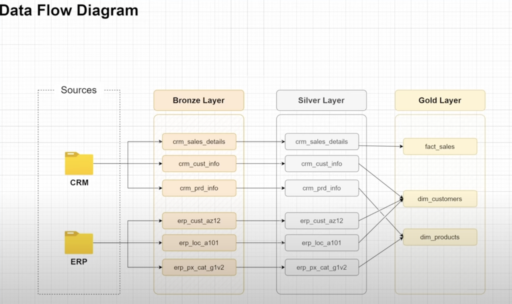
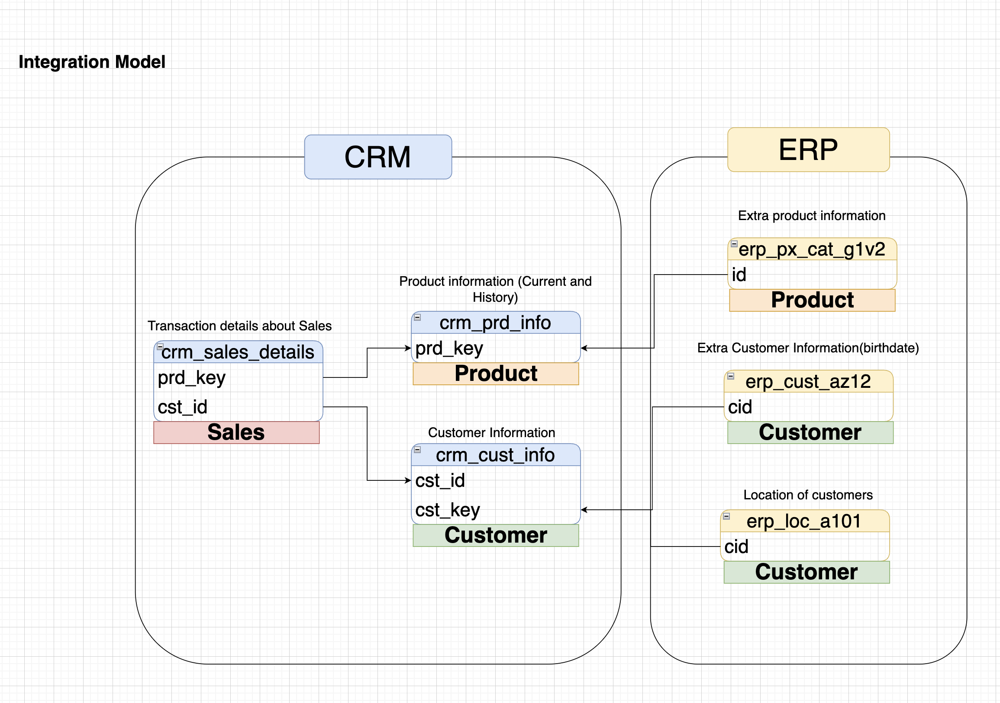
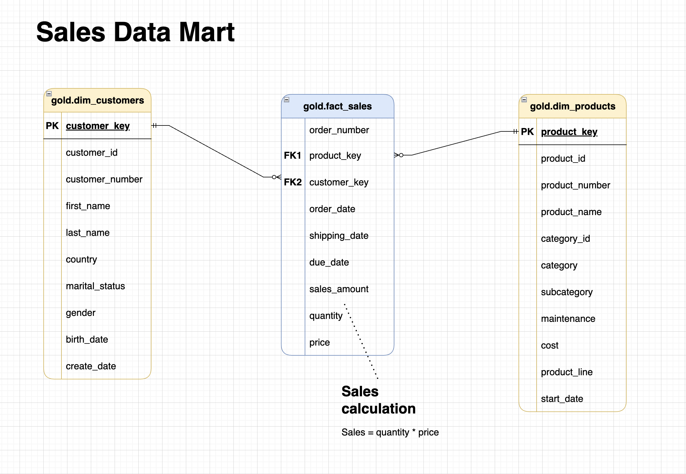

# 📘 Data Warehouse — Medallion Architecture (SQL Server)

## 🚀 Project Overview
This project demonstrates how to build a **Data Warehouse** using the **Medallion Architecture** (Bronze → Silver → Gold) on **SQL Server 2022**.  
The solution integrates **ERP** and **CRM** CSV datasets into a centralized database for analytics, reporting, and business insights.  

Main goals:
- 🛠️ Implement a **modular ETL pipeline** with SQL procedures.  
- 🧹 Apply **data cleaning & transformation** across layers.  
- ⭐ Build a **star schema** (facts & dimensions) in the Gold layer.  
- ✅ Ensure **data quality** with validation checks.  

---

## 🏗️ Architecture
The warehouse follows the **Medallion Architecture**:
- 🥉 **Bronze** – Raw ingested data from ERP/CRM CSV files.  
- 🥈 **Silver** – Cleansed, standardized, deduplicated data.  
- 🥇 **Gold** – Business-ready data model with fact and dimension views.  

  
*End-to-end data flow from sources to Gold layer.*

  
*CRM & ERP integration model in Silver.*

  
*Star schema for analytics (Gold).*

---

## ⚙️ Setup & Installation

### 1. Prerequisites
- 🐳 [Docker](https://www.docker.com/) & [Docker Compose](https://docs.docker.com/compose/)  
- 🖥️ SQL client (Azure Data Studio / DBeaver / sqlcmd)

### 2. Run SQL Server with Docker Compose
```bash
docker-compose up -d
```

- 📌 SQL Server runs on **localhost:1433**  
- 👤 User: `sa`  
- 🔑 Password: `MyStrongPassw0rd!`  
- 📂 Mounted datasets: `./datasets`  

*(see [docker-compose.yml](./docker-compose.yml))*

### 3. Initialize Database
Run:
```sql
:init_database.sql
```
This will create `DataWarehouse` with schemas:
- 🥉 `bronze`
- 🥈 `silver`
- 🥇 `gold`

### 4. Create Tables
Execute DDL scripts:
```sql
:ddl_bronze.sql
:ddl_silver.sql
:ddl_gold.sql
```

### 5. Load Data
- **Step 1:** Load CSV files into Bronze
```sql
EXEC bronze.load_bronze;
```
- **Step 2:** Transform & load to Silver
```sql
EXEC silver.load_silver;
```

### 6. Validate Data
Run quality checks in Silver:
```sql
:quality_checks_silver.sql
```

---

## 📂 Project Structure
```
├── docker-compose.yml        # SQL Server in Docker
├── init_database.sql         # Create DB & schemas
├── ddl_bronze.sql            # Bronze layer tables
├── ddl_silver.sql            # Silver layer tables
├── ddl_gold.sql              # Gold layer views
├── proc_load_bronze.sql      # ETL: load raw CSV → Bronze
├── proc_load_silver.sql      # ETL: Bronze → Silver transformations
├── quality_checks_silver.sql # Data validation & consistency checks
├── data_catalog.md           # Documentation of Gold layer
├── datasets/                 # ERP & CRM CSV source files
├── Data flow.png             # Data flow diagram
├── Integration Model.png     # Integration model diagram
└── Sales data mart.png       # Star schema diagram
```

---

## 📊 Data Catalog (Gold Layer)
Extract from [data_catalog.md](./data_catalog.md):

### **gold.dim_customers**
- 🧑 Surrogate + business keys  
- 🏡 Demographic + geographic attributes  
- 📅 Birthdate, create date  

### **gold.dim_products**
- 📦 Product categories, subcategories, costs  
- 📈 Product line, availability start date  

### **gold.fact_sales**
- 💰 Transactional sales fact table  
- 🔗 Linked to **dim_customers** and **dim_products**  

---

## ✅ Data Quality Checks
Implemented in [quality_checks_silver.sql](./quality_checks_silver.sql):
- 🚫 Null/duplicate checks on keys  
- ✂️ Trim & standardization for text fields  
- 📅 Validation of date ranges (order < ship < due)  
- ➗ Consistency: `sales = quantity * price`  
- 👩‍🦰 Gender & marital status normalization  
- 🌍 Country code normalization  

---

## 🔮 Future Improvements
- ⏱️ Orchestration with **Apache Airflow** (Bronze → Silver → Gold DAGs).  
- 🗂️ Implement **Slowly Changing Dimensions (SCD2)** in Gold.  
- 📜 Add **historization** (currently latest-only dataset is used).  
- 📊 Extend with BI dashboards (Metabase, Power BI).  
